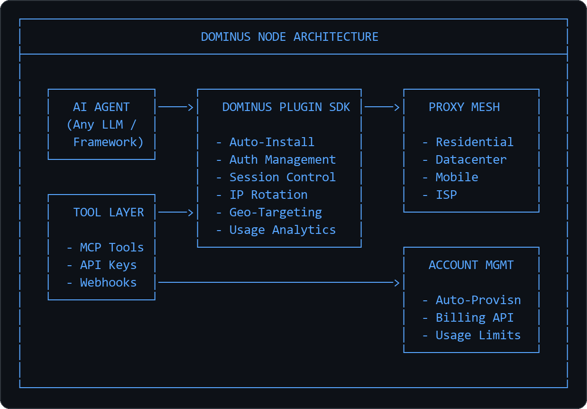
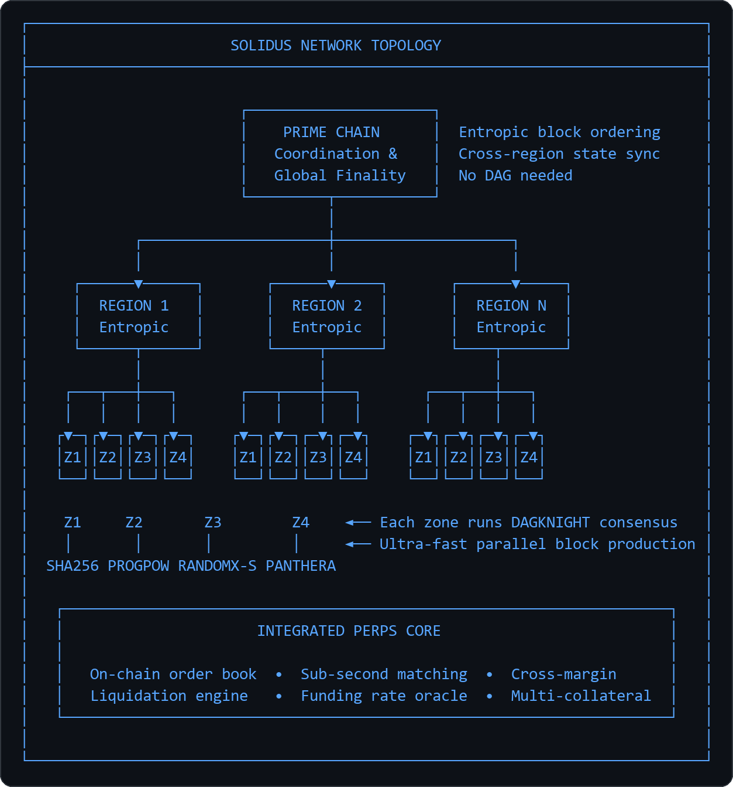
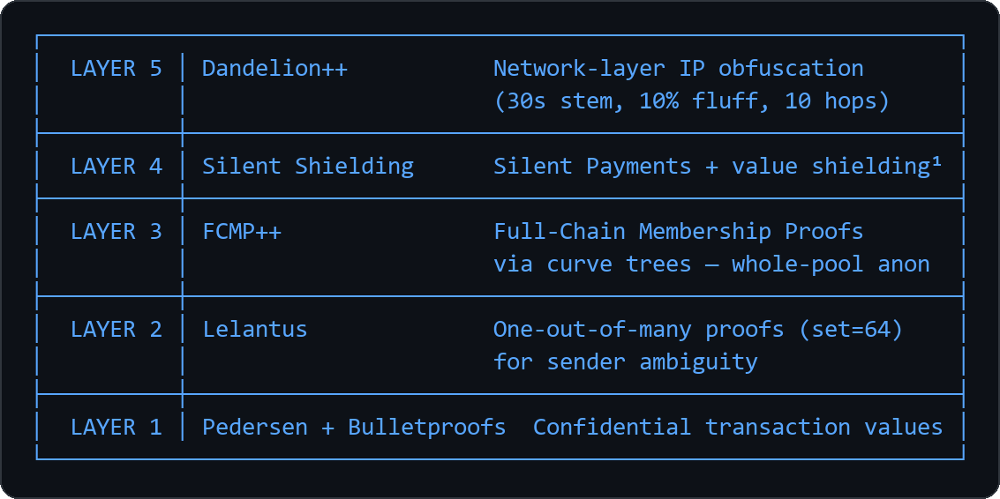
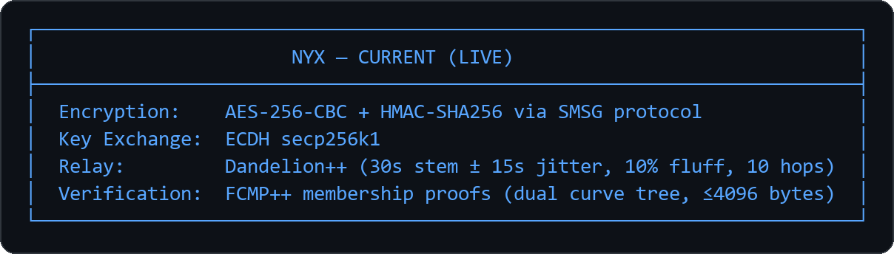
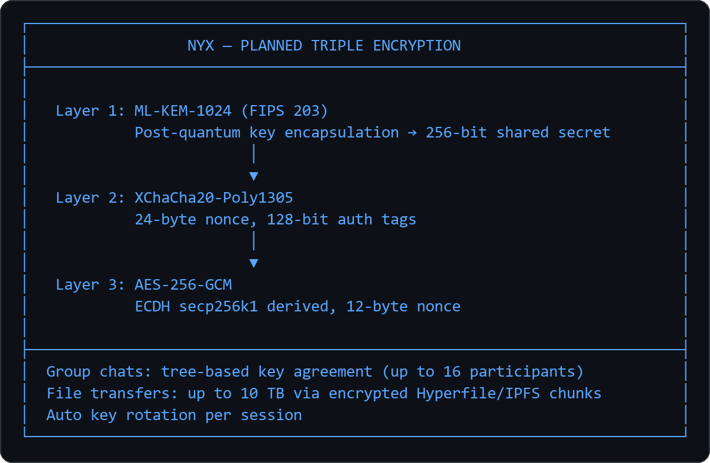
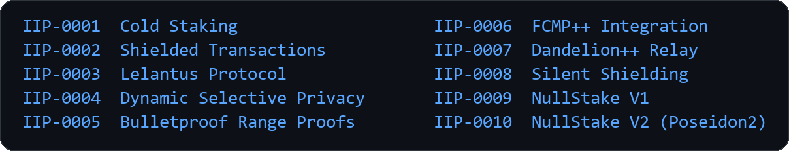
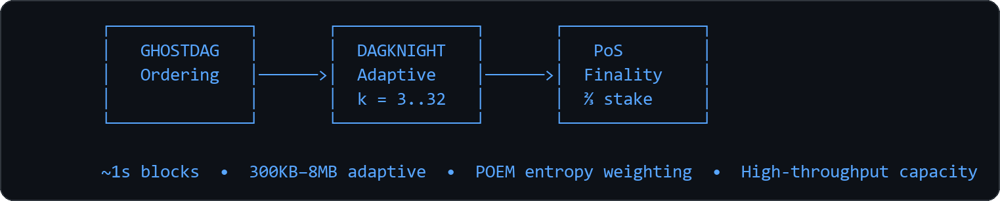
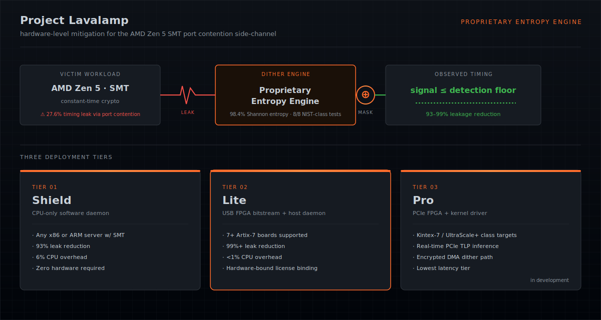
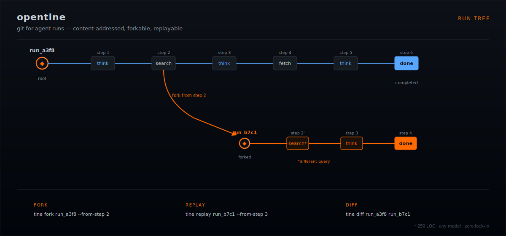
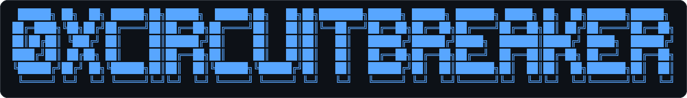

<div align="center">


<a href="https://github.com/0xcircuitbreaker"></a>
<a href="https://github.com/0xcircuitbreaker"></a>

<br/>

<a href="https://dominusnode.com"></a>&nbsp;
<a href="https://github.com/Dominus-Node"></a>&nbsp;
<a href="https://innova-foundation.com"></a>&nbsp;
<a href="https://github.com/innova-foundation"></a>

<br/><br/>

```
Building autonomous AI infrastructure, high-performance DeFi,
and privacy-first blockchain protocols from the ground up.
```

<br/>

<a href="#-dominus-node--autonomous-ai-proxy-infrastructure"></a>
<a href="#-solidus-network--high-performance-multi-chain-perps-exchange"></a>
<a href="#-innova-inn--privacy-first-blockchain-protocol"></a>
<a href="#-project-lavalamp--hardware-level-side-channel-mitigation"></a>
<a href="#-opentine--git-for-agent-runs"></a>

</div>

<br/>

---

<br/>

<!-- ═══════════════════════════════════════════════════════════════════ -->
<!-- DOMINUS NODE                                                       -->
<!-- ═══════════════════════════════════════════════════════════════════ -->

<div align="center">
<h2>

DOMINUS NODE — Autonomous AI Proxy Infrastructure
</h2>

<a href="https://dominusnode.com"></a>&nbsp;
<a href="https://github.com/Dominus-Node"></a>

</div>

<br/>

**Dominus Node** is an enterprise proxy IP service purpose-built for **AI agents**. Unlike traditional proxy providers, Dominus is designed from the ground up for autonomous agent workflows — providing a plugin and tool ecosystem that AI agents can discover, install, configure, and operate **without human intervention**.

<p align="center">
  <a href="./assets/readme/dominus-node-architecture.png">
    
  </a>
</p>

### 28 Integrations — Agent-Native Plugin Ecosystem

Every integration is designed for **autonomous installation and self-management** — agents discover the plugin they need, install it, authenticate, and begin routing traffic through the proxy mesh with zero human setup.

<table>
<tr>
<td width="33%" valign="top">

**AI Agent Frameworks**

| Plugin | Framework |
|:---|:---|
| [`dominusnode-langchain`](https://github.com/Dominus-Node/dominusnode-langchain) | LangChain |
| [`dominusnode-crewai`](https://github.com/Dominus-Node/dominusnode-crewai) | CrewAI |
| [`dominusnode-llamaindex`](https://github.com/Dominus-Node/dominusnode-llamaindex) | LlamaIndex |
| [`dominusnode-autogpt`](https://github.com/Dominus-Node/dominusnode-autogpt) | AutoGPT |
| [`dominusnode-metagpt`](https://github.com/Dominus-Node/dominusnode-metagpt) | MetaGPT |
| [`dominusnode-superagi`](https://github.com/Dominus-Node/dominusnode-superagi) | SuperAGI |
| [`dominusnode-pydantic-ai`](https://github.com/Dominus-Node/dominusnode-pydantic-ai) | Pydantic AI |
| [`dominusnode-camel-ai`](https://github.com/Dominus-Node/dominusnode-camel-ai) | CAMEL-AI |
| [`dominusnode-agno`](https://github.com/Dominus-Node/dominusnode-agno) | Agno |
| [`dominusnode-agent--zero`](https://github.com/Dominus-Node/dominusnode-agent--zero) | Agent Zero |
| [`dominusnode-semantic-kernel`](https://github.com/Dominus-Node/dominusnode-semantic-kernel) | Semantic Kernel |
| [`dominusnode-haystack`](https://github.com/Dominus-Node/dominusnode-haystack) | Haystack |
| [`dominusnode-composio`](https://github.com/Dominus-Node/dominusnode-composio) | Composio |

</td>
<td width="33%" valign="top">

**Platforms & Orchestration**

| Plugin | Platform |
|:---|:---|
| [`dominusnode-n8n`](https://github.com/Dominus-Node/dominusnode-n8n) | n8n |
| [`dominusnode-flowise`](https://github.com/Dominus-Node/dominusnode-flowise) | Flowise |
| [`dominusnode-dify`](https://github.com/Dominus-Node/dominusnode-dify) | Dify |
| [`dominusnode-mastra`](https://github.com/Dominus-Node/dominusnode-mastra) | Mastra |
| [`dominusnode-vercel-ai`](https://github.com/Dominus-Node/dominusnode-vercel-ai) | Vercel AI SDK |
| [`dominusnode-moltbook`](https://github.com/Dominus-Node/dominusnode-moltbook) | Moltbook |
| [`dominusnode-openclaw`](https://github.com/Dominus-Node/dominusnode-openclaw) | OpenClaw |
| [`dominusnode-ironclaw`](https://github.com/Dominus-Node/dominusnode-ironclaw) | IronClaw |
| [`mcp-server`](https://github.com/Dominus-Node/mcp-server) | MCP Server |

**LLM Provider Plugins**

| Plugin | Provider |
|:---|:---|
| [`dominusnode-openai`](https://github.com/Dominus-Node/dominusnode-openai) | OpenAI |
| [`dominusnode-gemini`](https://github.com/Dominus-Node/dominusnode-gemini) | Google Gemini |
| [`dominusnode-chatgpt`](https://github.com/Dominus-Node/dominusnode-chatgpt) | ChatGPT |
| [`dominusnode-pi`](https://github.com/Dominus-Node/dominusnode-pi) | Pi |

</td>
<td width="33%" valign="top">

**Core SDKs**

| SDK | Language |
|:---|:---|
| [`dominusnode-python`](https://github.com/Dominus-Node/dominusnode-python) |  |
| [`dominusnode-node`](https://github.com/Dominus-Node/dominusnode-node) |  |
| [`dominusnode-go`](https://github.com/Dominus-Node/dominusnode-go) |  |
| [`dominusnode-rust`](https://github.com/Dominus-Node/dominusnode-rust) |  |
| [`dominusnode-java`](https://github.com/Dominus-Node/dominusnode-java) |  |
| [`dominusnode-cpp`](https://github.com/Dominus-Node/dominusnode-cpp) |  |

<br/>

**Key Capabilities**

- Autonomous plugin discovery & install
- Programmatic account provisioning
- API key rotation & billing controls
- Sticky sessions & IP rotation
- Geo-targeting & concurrent sessions
- Per-agent bandwidth telemetry
- MCP tool server for Claude/GPT agents
- Zero human intervention workflows

</td>
</tr>
</table>

<br/>

---

<br/>

<!-- ═══════════════════════════════════════════════════════════════════ -->
<!-- SOLIDUS NETWORK                                                    -->
<!-- ═══════════════════════════════════════════════════════════════════ -->

<div align="center">
<h2>

SOLIDUS NETWORK — High-Performance Multi-Chain Perps Exchange
</h2>


</div>

<br/>

**Solidus Network** is a high-performance perpetuals exchange built on a **multi-algorithm, multi-chain DAGKNIGHT architecture**. Forked from Quai Network and re-engineered with **4 zones per region**, each running a **different mining algorithm for a different hardware class** — ASIC, GPU, CPU, and Mobile miners all participate **without competing against each other**. Built-in perps core with on-chain order matching. Research benchmarks are **matching Hyperliquid-class speeds and TPS**.

### DAGKNIGHT Zone-Level DAG Architecture

DAGKNIGHT consensus runs **at the zone level** where transaction throughput matters. Region and Prime chains use **entropic block ordering**

<p align="center">
  <a href="./assets/readme/solidus-network-topology.png">
    
  </a>
</p>

### Multi-Algorithm Zone Architecture — No Cross-Class Competition

Each region contains **4 parallel zones**, each running a distinct consensus algorithm. Miners of different hardware classes **never compete against each other** — each class has its own dedicated zone with balanced difficulty, ensuring fair participation from enterprise ASICs down to mobile devices.

| Zone | Algorithm | Hardware Class | Design Goal |
|:---|:---|:---|:---|
| **Zone 1** | SHA-256 | ASIC miners | Maximum hashrate throughput |
| **Zone 2** | ProgPoW | GPU miners (NVIDIA/AMD) | Memory-hard, ASIC-resistant |
| **Zone 3** | RandomX-S | CPU miners | Modified RandomX — breaks Antminer RandomX ASICs |
| **Zone 4** | Panthera | Mobile devices | Lightweight mobile-optimized algorithm |

### Performance — Matching Hyperliquid

| Metric | Target |
|:---|:---|
| **Throughput** | Hyperliquid-competitive TPS (200,000+ ops/sec) |
| **Zone Consensus** | DAGKNIGHT — completed from Kaspa research |
| **Region/Prime** | Entropic block ordering (no DAG overhead) |
| **Order Matching** | Sub-second on-chain execution |
| **Finality** | Instant at zone level, cross-region within epoch |
| **Architecture** | Quai fork — hierarchical, sharded, merged-mined |

### Perps Core

| Feature | Description |
|:---|:---|
| **On-Chain Order Book** | Fully on-chain limit/market order matching — no off-chain sequencer |
| **Cross-Margin** | Unified margin across positions with portfolio-level risk |
| **Liquidation Engine** | MEV-resistant liquidation with keeper incentives |
| **Funding Rates** | Decentralized oracle-fed funding rate mechanism |
| **Multi-Collateral** | Multiple collateral types with real-time mark pricing |

### Tech Stack

<div align="center">


</div>

<br/>

---

<br/>

<!-- ═══════════════════════════════════════════════════════════════════ -->
<!-- INNOVA + IDAG + INVS                                               -->
<!-- ═══════════════════════════════════════════════════════════════════ -->

<div align="center">
<h2>

INNOVA (INN) — Privacy-First Blockchain Protocol
</h2>

<a href="https://innova-foundation.com"></a>&nbsp;
<a href="https://github.com/innova-foundation"></a>

<br/><br/>

[](https://github.com/innova-foundation/innova)
[](https://github.com/innova-foundation/innova)
[](https://github.com/innova-foundation/innova)
[](https://github.com/innova-foundation/innova)

</div>

<br/>

**Innova** is a hybrid PoW/PoS privacy blockchain with **1,500+ commits**, built on the **Tribus** hashing algorithm (three NIST5 algorithms), ~15s block times, and a hardcapped 18M supply. Five-layer privacy architecture, decentralized services layer, and a Collateral Node network.

### Five-Layer Privacy Stack

<p align="center">
  <a href="./assets/readme/innova-privacy-stack.png">
    
  </a>
</p>

<sub>¹ Layer 4 Silent Shielding: RPC commands registered (`sp_send`, `sp_getnewaddress`);</sub>

### Protocol Features

<table>
<tr>
<td width="50%" valign="top">

**Privacy & Staking**

| Feature | Description |
|:---|:---|
| **NullStake V1** | Sigma protocol anonymous staking (block 7,325,000) |
| **NullStake V2** | Poseidon2 + BPAC compact proofs with viewing-key auditability (block 7,330,000) |
| **NullStake V3** | Enhanced ZK staking circuits (block 7,335,000) |
| **Stealth Addresses** | One-time destination addresses for every transaction |
| **Native Tor** | Built-in onion routing for network-level privacy |
| **Dynamic Selective Privacy** | 8 configurable privacy modes (IIP-0004) |
| **Ring Signatures** | Transaction path obfuscation |

</td>
<td width="50%" valign="top">

**Decentralized Services**

| Feature | Description |
|:---|:---|
| **Nyx** | Encrypted messaging system — currently live with AES-256-CBC + HMAC-SHA256 via SMSG, Dandelion++ relay, and FCMP++ membership proofs. Planned upgrade to triple-layer encryption: ML-KEM-1024 (post-quantum) + XChaCha20-Poly1305 + AES-256-GCM with group chats (16 participants) and 10 TB file transfers via encrypted Hyperfile/IPFS chunks |
| **IDNS** | Blockchain-native DNS — A, AAAA, NS, PTR, MX, TXT, CNAME records anchored on-chain for decentralized service routing |
| **Proof of Data (PoD)** | On-chain timestamped record anchoring via `proofofdata` / `hyperfilepod` RPC — digital artifact integrity verification |
| **Hyperfile** | IPFS-based anonymous file uploads with on-chain integrity references |

</td>
</tr>
</table>

<details>
<summary><b>Nyx Encryption Stack (Detail)</b></summary>

<br/>

**Live now:**
<p align="center">
  <a href="./assets/readme/nyx-current-live.png">
    
  </a>
</p>

**Proposed upgrade (IIP):**
<p align="center">
  <a href="./assets/readme/nyx-planned-triple-encryption.png">
    
  </a>
</p>

</details>

<details>
<summary><b>Innova Improvement Proposals (IIPs)</b></summary>

<br/>

<p align="center">
  <a href="./assets/readme/innova-iips.png">
    
  </a>
</p>

</details>

<details>
<summary><b>Network Specifications</b></summary>

<br/>

| Parameter | Value |
|:---|:---|
| **Algorithm** | Tribus PoW (3x NIST5) + PoS (6% annual) |
| **Block Time** | ~15 seconds |
| **Total Supply** | 18,000,000 INN |
| **Collateral Nodes** | 25,000 INN collateral, 65% block reward |
| **Confirmations** | 10 required, 75 block maturity |
| **Stake Age** | 10-hour minimum |
| **BIP39 Coin Type** | 116 |
| **Ports** | P2P 14530, RPC 14531, CN 14539 |
| **Atomic Swaps** | BIP65 CLTV |
| **Multi-Sig** | Native support |

</details>

<br/>

### IDAG — Incremental DAG Consensus

> *The first block DAG with DAGKNIGHT adaptive ordering, PoS finality, and full zero-knowledge privacy.*

IDAG is Innova's next-generation consensus — a four-phase migration from linear blockchain to a high-throughput block DAG. First to implement **epoch-anchored FCMP++ membership proofs** in a DAG and **adaptive DAGKNIGHT k inference**.

<p align="center">
  <a href="./assets/readme/idag-consensus-flow.png">
    
  </a>
</p>

| Parameter | Value |
|:---|:---|
| **Block Interval** | ~1 second (post-DAG fork at block 7,450,000) |
| **Block Size** | 300 KB floor – 8 MB ceiling (adaptive median over 1000-block window) |
| **Finality** | `TENTATIVE` (⅓ stake) → `SOFT` (½ stake) → `HARD` (⅔ stake, 3 consecutive epochs) |
| **GHOSTDAG** | Fixed k=18, pre-DAGKNIGHT ordering |
| **DAGKNIGHT** | Adaptive k=3..32 (EMA-inferred, activates at block 7,500,000) |
| **Fork Resolution** | POEM — `GetBlockEntropy()` computes entropy from inverted block hash (staged) |
| **Epoch** | 300 blocks (~5 min), min 2 unique voters for finality |
| **Privacy** | Epoch-anchored FCMP++ membership proofs via dual curve tree (secp256k1 + Ed25519) with deterministic DAG-ordered commits |

<br/>

### INVS — Shielded Asset Protocol

**INVS** is the shielded asset layer within the Innova ecosystem — fully private value transfer with ZK-proof verification, leveraging all five privacy layers and IDAG's throughput for high-frequency confidential transactions.

### Innova Tech Stack

<div align="center">


</div>

<br/>

---

<br/>

<!-- ═══════════════════════════════════════════════════════════════════ -->
<!-- PROJECT LAVALAMP                                                   -->
<!-- ═══════════════════════════════════════════════════════════════════ -->

<div align="center">
<h2>

PROJECT LAVALAMP — Hardware-Level Side-Channel Mitigation
</h2>

&nbsp;
&nbsp;


</div>

<br/>

**Project Lavalamp** is a hardware-software security product that masks the **AMD Zen 5 SMT port contention timing side-channel** — a **27.6% signal leakage** vulnerability that AMD, Google, Microsoft, and NVIDIA all declined to fix. At its core is a proprietary entropy engine that generates high-quality dither patterns to bury timing signals below the detection floor. Validated on live FPGA hardware — **8/8 NIST-class statistical quality tests pass, 98.4% Shannon entropy efficiency**, with integrity sealing across every released bitstream.

### Recent Milestones

- **Hardware validation complete** on the Artix-7 reference platform — full end-to-end signal-masking loop running on live silicon.
- **Shield (software) tier** daemon feature-complete on x86 and ARM Neoverse with 93% leak reduction at ~6% CPU overhead.
- **Lite (USB-FPGA) tier** shipping across 7 Artix-7 boards with 99%+ leak reduction at <1% host overhead.
- **Pro (PCIe) tier** in active development — kernel driver and TLP-inference pipeline under bring-up.
- **Phase 2 porting effort underway** — extending the FPGA build system to 17 boards across 6 vendors.

<p align="center">
  <a href="./assets/readme/lavalamp-architecture.svg">
    
  </a>
</p>

### Three Deployment Tiers

| Tier | Form Factor | Leak Reduction | CPU Overhead | Price |
|:---|:---|:---|:---|:---|
| **Shield** | CPU-only software daemon (x86 / ARM Neoverse) | 93% | 6% | $99–299 / yr |
| **Lite** | USB FPGA bitstream + host daemon — 7+ Artix-7 boards | 99%+ | <1% | $499–999 / yr |
| **Pro** *(in dev)* | PCIe FPGA card + kernel driver + TLP inference | 99%+ | ~0% | $2,000–5,000 / yr |

### Universal FPGA Build System

One command per supported board — `vivado -mode batch -source build_board.tcl -tclargs <board>`. Currently shipping on the Artix-7 family; Phase 2 validates across **17 FPGA boards spanning 6 vendors** (AMD/Xilinx, Intel/Altera, Lattice, Gowin, Microchip).

| Vendor | Families | Status |
|:---|:---|:---|
| **AMD / Xilinx** | Artix-7, Kintex-7, Virtex UltraScale+ | 7 boards shipping · Kintex/UltraScale validation in progress |
| **Intel / Altera** | Cyclone V SoC | Planned (Phase 2) |
| **Lattice** | ECP5 | Planned (Phase 2) |
| **Gowin** | GW2A | Planned (Phase 2) |
| **Microchip** | PolarFire SoC | Planned (Phase 2) |

### Vendor Refusal — Why This Product Exists

| Vendor | Tracking ID | Response |
|:---|:---|:---|
| AMD | `AMD-NSACNT3N` | *"Expected Behavior"* |
| Google / Chromium | Issue `475937586` | *"Won't Fix"* |
| Microsoft MSRC | `VULN-171518` | *"Does not meet criteria"* |
| NVIDIA PSIRT | Tracking `5775002` | *"Expected behavior"* |

Disabling SMT mitigates the leak but costs **~50% of compute capacity**. Lavalamp recovers 97% of that capacity while reducing leakage by **93–99%** depending on tier. No other product targets this specific vulnerability at the hardware level.

### Tech Stack

<div align="center">


</div>

<br/>

---

<br/>

<!-- ═══════════════════════════════════════════════════════════════════ -->
<!-- OPENTINE                                                           -->
<!-- ═══════════════════════════════════════════════════════════════════ -->

<div align="center">
<h2>

OPENTINE — Git for Agent Runs
</h2>

<a href="https://opentine.com"></a>&nbsp;
<a href="https://github.com/0xcircuitbreaker/opentine"></a>&nbsp;
<a href="https://pypi.org/project/opentine/"></a>

</div>

<br/>

**opentine** is git for agent runs. Every AI agent execution becomes a **content-addressed run tree** — forkable, replayable, diffable, and serializable to disk. Pause on your laptop, resume on a server. Branch from step 7 with a different prompt. Diff two runs side by side. The core is **~250 lines of Python**, model-agnostic, and has zero framework lock-in.

A **tine** is the prong of a fork. opentine literally forks your agent runs.

### Recent Milestones

- **Public release on PyPI** — `pip install opentine`, Apache 2.0, zero framework lock-in.
- **Multi-provider adapters shipped** — native support for Anthropic, OpenAI, Google, and Ollama, plus OpenAI-compatible wrappers for Kimi, DeepSeek, Qwen, GLM, Groq, Together, and Mistral.
- **Full CLI surface live** — `run`, `ls`, `show`, `replay`, `fork`, `diff`, `resume`.
- **Serialization format stable** — `.tine` run trees are portable across machines; pause on laptop, resume on a server.
- **Next up** — remote run sync, hosted replay viewer, and tighter integrations with agent frameworks that already appear on the comparison table below.

<p align="center">
  <a href="./assets/readme/opentine-run-tree.svg">
    
  </a>
</p>

### Why opentine

| | Install size | Forkable runs | Any model | Core LOC |
|:---|:---|:---|:---|:---|
| LangChain | 166 MB | No | Partial | ~200k |
| LangGraph | 51 MB | Checkpoints only | Partial | ~50k |
| CrewAI | 173 MB | No | Partial | ~30k |
| smolagents | 198 MB | No | Partial | ~15k |
| **opentine** | **<5 MB** | **Yes** | **Yes** | **~250** |

### CLI

```
tine run <script.py>          Execute agent, stream steps, save run tree
tine ls                       List recent runs (status, cost, model)
tine show <run_id>            Pretty-print the tree (like git log --graph)
tine replay <id> [--from N]   Replay from a step
tine fork <id> --from-step N  Branch a new run
tine diff <run_a> <run_b>     Side-by-side comparison
tine resume <run_id>          Resume a paused run
```

### Model Support

Treats every provider equally. Swap with one line — native adapters for **Anthropic, OpenAI, Google, Ollama**, plus OpenAI-compatible wrappers for **Kimi, DeepSeek, Qwen, GLM, Groq, Together, Mistral**.

```python
from opentine import Agent
from opentine.models.anthropic import Anthropic

agent = Agent(model=Anthropic("claude-sonnet-4-20250514"))
run = agent.run_sync("What is opentine?")
run.save("result.tine")
```

### Tech Stack

<div align="center">


</div>

<br/>

---

<br/>


<!-- ═══════════════════════════════════════════════════════════════════ -->
<!-- FULL TECH STACK                                                    -->
<!-- ═══════════════════════════════════════════════════════════════════ -->

<div align="center">
<h2>

Full Tech Stack
</h2>
</div>

<div align="center">

#### Languages


#### Cryptography & Privacy


-0d1117?style=for-the-badge)


#### Consensus & Networking


#### Infrastructure


</div>

<br/>

---

<br/>

<!-- ═══════════════════════════════════════════════════════════════════ -->
<!-- GITHUB ANALYTICS                                                   -->
<!-- ═══════════════════════════════════════════════════════════════════ -->

<div align="center">
<h2>

GitHub Analytics
</h2>


<br/>


<br/><br/>


</div>

<br/>

---

<br/>

<!-- ═══════════════════════════════════════════════════════════════════ -->
<!-- PINNED REPOS                                                       -->
<!-- ═══════════════════════════════════════════════════════════════════ -->

<div align="center">
<h2>

Pinned Repositories
</h2>

<a href="https://github.com/innova-foundation/innova">
  
</a>
<a href="https://github.com/0xcircuitbreaker/opentine">
  
</a>
<a href="https://github.com/Dominus-Node/mcp-server">
  
</a>
<a href="https://github.com/Dominus-Node/dominusnode-openclaw">
  
</a>
<a href="https://github.com/Dominus-Node/dominusnode-python">
  
</a>

</div>

<br/>

---

<br/>

<!-- ═══════════════════════════════════════════════════════════════════ -->
<!-- ADDITIONAL ECOSYSTEM                                               -->
<!-- ═══════════════════════════════════════════════════════════════════ -->

<details>
<summary><h3>Additional Research</h3></summary>

<br/>

**MEV & Ethereum Infrastructure** — Block builder tooling (Rust), P2P mempool crawlers, EVM benchmarking, and DeFi protocol analysis.

**Cryptanalysis & Bitcoin Research** — UTXO analysis, chainstate parsing, vanity address generation, and parallel cryptanalysis tooling.

**AI/ML** — Autonomous agent architectures, multimodal models, and research that feeds directly into Dominus Node's agent-first design philosophy.

</details>

<br/>

---

<div align="center">

<br/>

<a href="./assets/readme/circuitbreaker-banner.png">
  
</a>

<sub>Building autonomous AI infrastructure, high-performance DeFi, and privacy-first blockchain protocols.</sub>

<br/><br/>


<br/><br/>


</div>
